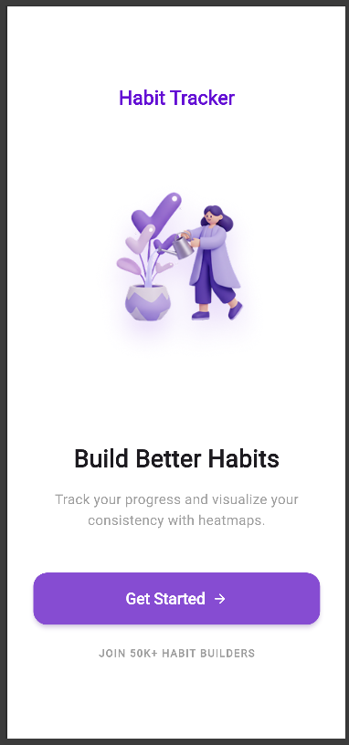
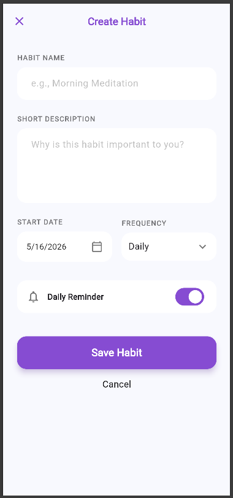
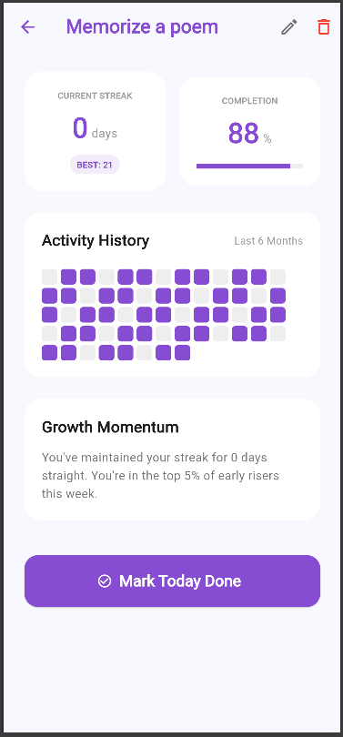
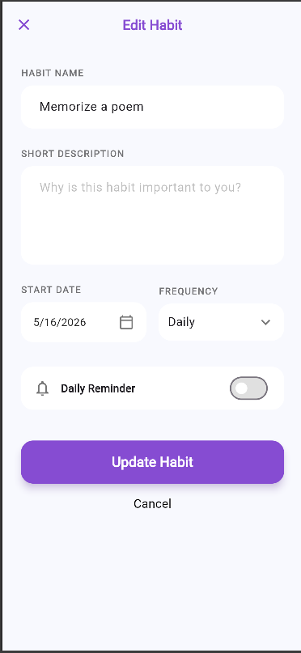
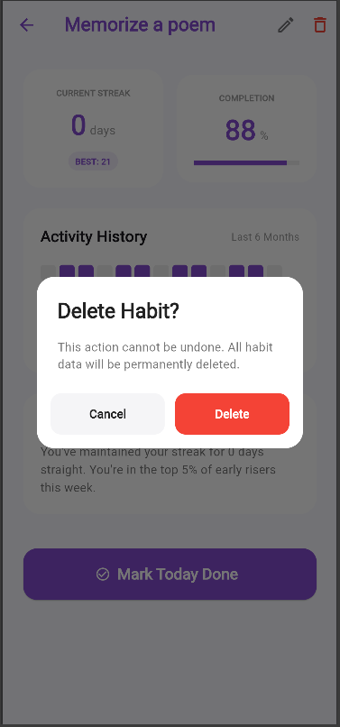

# Habit Tracker

Habit Tracker is a Flutter application that performs CRUD (Create, Read, Update, Delete) operations using DummyJSON API, the latest Bloc state management solution for state management and the dio package for making network requests.

## Student Info

| Name | Id | Section |
|------|----|--------|
| Tsion Bekalu | UGR/9277/16 | 1 |

## Screenshots of the working app

### Onboarding


### Home Screen


### Create Habit


### Habit Details


### Edit Habit


### Delete Habit


## Features

- Create, read, update, and delete habits (CRUD)
- Toggle habit completion
- Habit streak tracking
- Clean UI with smooth interactions
- Loading and error states using Bloc
- API integration using Dio

## Project Structure

```txt
assets/
├── screenshots/
lib/
│
├── core/
│   ├── navigation/
│   ├── network/
│   ├── theme/
├── data/
│   ├── models/
│   ├── repositories/
│
├── domain/
│   ├── entities/
│   ├── repositories/
│
├── presentation/
│   ├── blocs/
│   ├── screens/
│   ├── widgets/
│
└── main.dart

